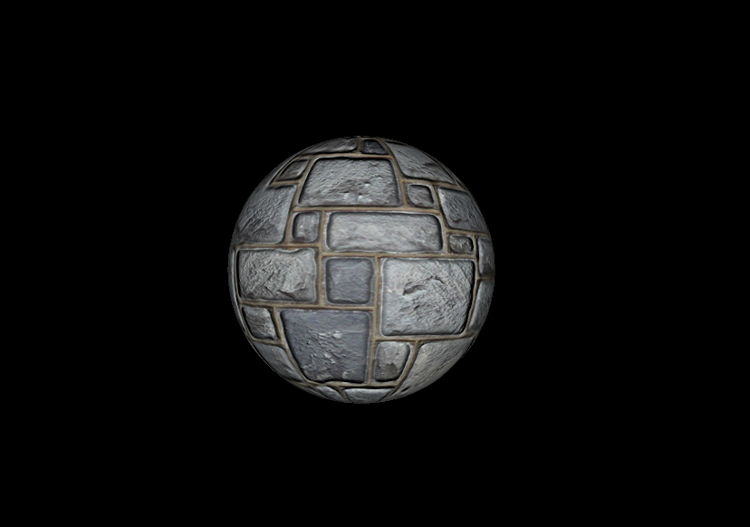

# Graphics Engine

This is a graphics engine being built from scratch following RasterTek tutorials on DirectX 11.

## Progress

## Buffers, Shaders, and HLSL

## Texturing

## Diffuse Lighting

## 3D Model Rendering

## Scaling, Rotation, and Translation

## Ambient Lighting

## Specular Lighting

## Multiple Point Lights

## 2D Rendering

## Sprites and Timers

## Font Engine

## FPS Counter

## Multitexturing

## Light Map

## Alpha Mapping

## Normal Mapping

## Specular Mapping

## Managing Multiple Shaders

## Frustum Culling

## Rendering Textures

## Fog

## Clipping Planes

## Texture Translation

## Transparency

## Reflection

## Water

## Glass and Ice Perturbation

## Fire

## Billboarding

## Z-Buffer

